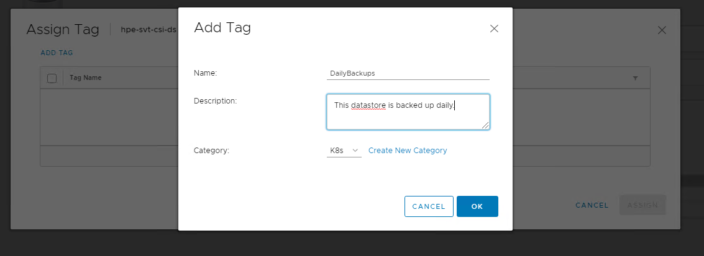
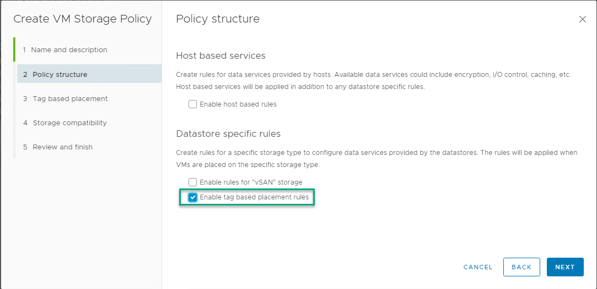
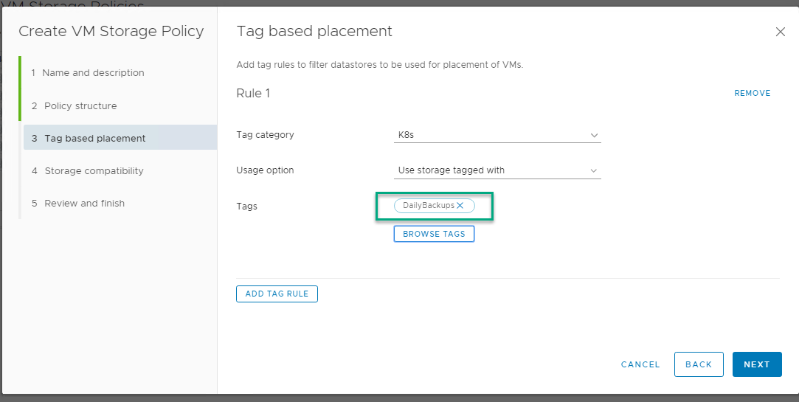

# Configure the HPE SimpliVity datastore to support persistent volumes

To configure an HPE SimpliVity datastore to supply storage for persistent volumes, you have to create a vSphere storage policy that uses tag based placement. You use the vSphere client to define the tag, assign the tag to the HPE SimpliVity datastore, and to create a storage policy that uses the tag. Once that is done, you update those values in the Kubernetes `StorageClass.yaml`.

## Tag the datastore

Use the vSphere client to access the Tags & Custom Attributes wizard. Create a new tag and supply a meaningful name and description that will help you identify the datastore.



Next, browse to the HPE SimpliVity datastore, and assign the tag to it. Right click the datastore and select **Tags & Custom Attributes > Assign Tag**.


## Create the storage policy

Use the **Create VM Storage Policy** wizard to create the storage policy. (Go to **Menu > Policies and Profiles**).

Make sure to select **Enable tag based placement rules**.



Use the same tag that you assigned to the HPE SimpliVity datastore.



## Define a Kubernetes StorageClass

After you create the storage policies, create a `StorageClass.yaml` that maps to this storage type.
You can specify either the `datastoreurl` or the `storagepolicyname`. If you specify both, the `datastoreurl` takes precedence.

To get the value for the datastoreurl parameter:

1. Navigate to the datastore.
2. Click the Summary tab.

3. Copy the URL value and add it to the StorageClass.yml file as shown below:

    ```yaml
    kind: StorageClass
    apiVersion: storage.k8s.io/v1
    metadata:
      name: simplivity-sc
      annotations:
        storageclass.kubernetes.io/is-default-class: "false"
    provisioner: csi.simplivity.hpe.com
    parameters:
      # datastoreurl and storagepolicyname are mutually exclusive. If both are
      # provided, then the datastoreurl is preferred over storagepolicyname
      datastoreurl: "ds:///vmfs/volumes/208f9178-aadd745f/"
      # Optional Parameter
      fstype: "NFS 3"
    ```

    This an example of the yaml with the storagepolicyname:

    ```yaml
    kind: StorageClass
    apiVersion: storage.k8s.io/v1
    metadata:
      name: simplivity-sc
      annotations:
        storageclass.kubernetes.io/is-default-class: "false"
    provisioner: csi.simplivity.hpe.com
    parameters:
      # datastoreurl and storagepolicyname are mutually exclusive. If both are
      # provided, then the datastoreurl is preferred over storagepolicyname
      storagepolicyname: "DailyBackups"  # Tag on selected datastore, from vCenter
      # Optional Parameter
      fstype: "ext4"
    ```

## Monitor persistent volumes in vSphere client

Use the vSphere client to see how Kubernetes has provisioned the HPE SimpliVity datastore that you mapped to your Kubernetes cluster.

1. Navigate to the vCenter Server instance, a data center, or datastore.

2. Click the Monitor tab, then click Container Volumes under Cloud Native Storage to view the details about the persistent volumes that are consuming storage.

3. Click the Details icon to access the details about the Kubernetes objects associated with the persistent volume.


